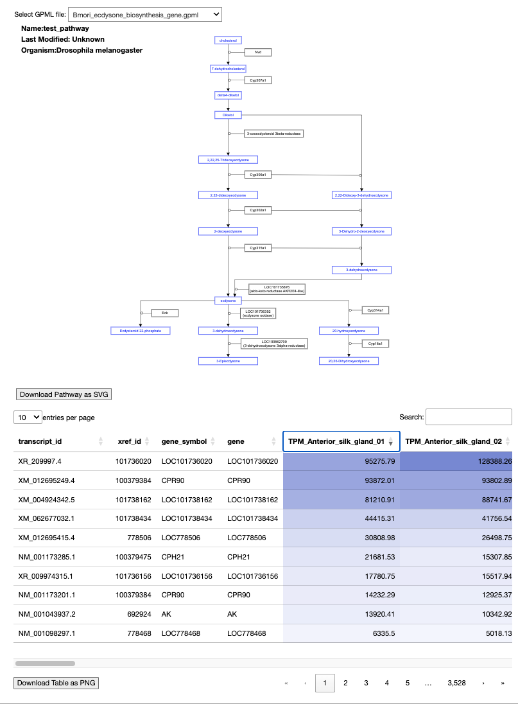
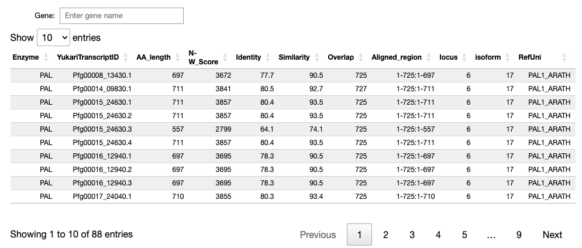

# qpx

Jupyter notebook で WikiPathways のパスウェイと選択したノードの属性テーブルを表示するツールです。

qp_view.ipynb を Jupyter notebook 環境で開いて利用します。

## memo

- メインの notebook の名前を qpx.ipynb に変更しました。
- メインの Python ファイルの名前を qp.py に変更しました。

## 使い方

### 前提条件

- docker および docker-compose がインストールされていること
- Docker Desktop を起動していること

### インストール

```
git clone https://github.com/dogrunjp/qpx
cd qpx
docker-compose up -d
(最新のDocker Desktopがインストールされている場合docker compose up -d)
```

起動後、http://localhost:8888/notebooks/work/qpx.ipynb にアクセスして、各セルを実行することで可視化を行えます。
可視化対象の GPML ファイルを増やしたい場合は、gpml フォルダの中に、拡張子を「.gpml」にしたファイルを置いてください。

アプリケーションに更新があった場合はローカルレポジトリを更新したあとにコンテナをビルドし直す必要があります。

```
docker compose down
docker compose build --no-cache
docker compose up -d
```

### 動作環境についての追記

- qpx は docker compose で起動した jupyter notebook で動作を確認しています。
- またローカルに構築した conda 環境でも notebook 上のアプリケーションの起動を確認しています（一部の動作に不具合があります）。
- conda で直接環境を構築する場合は以下の通りに Python とライブラリのバージョンを指定して conda の仮想環境と依存ライブラリのインストールを行なってください。

```
$ conda create -n qpx python=3.10
$ conda activate qpx
$ conda install -c conda-forge ipython=7.31.0 notebook=6.5.4
$ conda install ipywidgets=7.6.5
$ conda install pandas
$ conda install itables
$ conda install polars
```

- conda で構築する環境名は qpx である必要はありません
- python の version は 3.9 もしくは 3.10 のみ対応しています

# 主要コンポーネントについて

以下の２コンポーネントは、いずれも `qp.py` に記述されている。

### GpmlD3Visualizer

- 可視化のメインとなるコンポーネントであり、以下の３つの要素から構成される

1. パスウェイダイアグラム
2. 遺伝子情報テーブル
3. 発現量テーブル
   

### GeneSearchForm

- 遺伝子情報を検索するためのコンポーネント。検索ボックスと遺伝子情報テーブルの２要素から構成される。
- 初期化時に Gpml3DVisualizer のインスタンスを渡すことで、遺伝子情報テーブル内の行をクリックした際に、Gpml3DVisualizer の対応するノードを選択状態にすることができる。
- 検索ボックス部分は今後、より柔軟なクエリインターフェースに拡充予定
  

# Todo

- conda 環境でノード選択時に table が表示されない不具合の解消
- 複数のノードの選択（フィルターとする遺伝子を複数選択できるような UI）
- データテーブルのソースも選択できるようにすると便利？（複数のパスウェイを扱うケースが多いかまだよくわからない）
