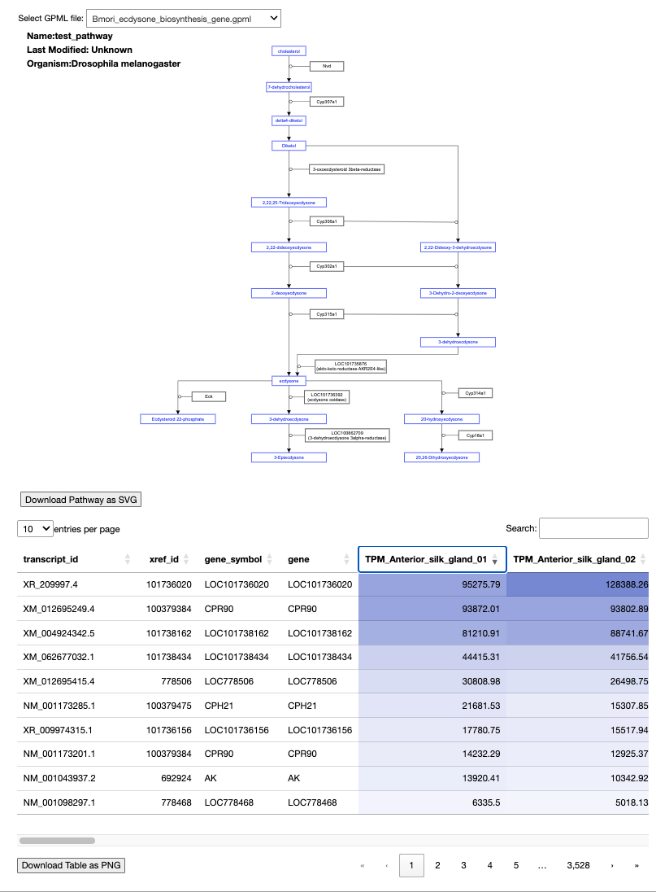
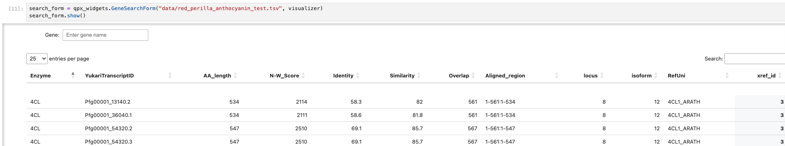

# Quest for Pathways with eXpression (QPX) 

Quest for Pathways with eXpression (QPX) は、Jupyter notebook で WikiPathways のパスウェイと選択したノードの属性テーブルを表示するツールです。
Jupyter notebook 環境で `qpx.ipynb` を開いて利用します。

## 使い方

### 前提条件

- `docker` および `docker-compose` がインストールされていること
- Docker Desktop を起動していること

### プロジェクトデータの配置

- QPXの実行にはGPMLと発現テーブルの少なくとも二つのファイルが必要です
- アプリケーションをビルドする前にこれらのファイルの配置についての設定を記述します

#### ケース1: ローカルのファイルを直接アプリケーションに配置する場合

- GPMLファイルをプロジェクトディレクトリの `gpml/` の下に置いてください
- 発現テーブルを `gpml/` もしくは `data/` に置き、notebook起動後にファイルパスを書き換えてください

#### ケース2: GitHubのデータレポジトリを利用する場合

1. qpxローカルレポジトリに `cd` しqpxレポジトリの中（root）でデータリポジトリをcloneする
2. qpxのプロジェクトに `gpml/` ディレクトリが残っている場合、元の `gpml/` を `gmpl_backup/` 等に変更する（削除しても構わない）
3. `docker-compose.yml` のvolumesにデータリポジトリのプロジェクトを以下のようにマッピングする（元の `".:/home/jovyan/work"` は削除しない）

```
volumes:
　- ".:/home/jovyan/work"
　- "./{data_repo_name}/{project_name}:/home/jovyan/work/gpml"
```

4. Jupyter notebook起動後、発現データのファイルパスを以下のように修正する

```
   expression_data_path = "gpml/(ファイル名)"
```


### インストール

```
git clone https://github.com/bonohu/qpx
cd qpx
docker compose up -d
```

起動後、http://localhost:8888/lab/tree/qpx.ipynb にアクセスして、各セルを実行することで可視化を行えます。
可視化対象の GPML ファイルを増やしたい場合は、`gpml/` ディレクトリの中に、拡張子を `.gpml` にしたファイルを置いてください。

アプリケーションに更新があった場合はローカルレポジトリを更新したあとにコンテナをビルドし直す必要があります。

```
docker compose down
docker compose build --no-cache
docker compose up -d
```

### モジュールを追加し別の可視化や解析を行いたい場合

qpxでは、選択した遺伝子のテーブルをpolarsのデータフレームとして取得して利用することができます。
また、新たにモジュールを読み込み選択したテーブルに対する解析手法や可視化手法をnotebookに追加することができます。

PyPIに登録されたPythonのモジュールを利用したい場合
requirements.txtにモジュールを記述した後にdockerのビルドを行ってください

#### seabornを利用しsubplotsを表示する例

1. アプリケーションのbuild前にrequirements.txtに"seaborn==0.13.2"を追加し、その後docker composeする
1. notebookを起動したら、記述済みのcellの後に下記のような処理を追加する

```
import matplotlib.pyplot as plt
import seaborn as sns
ids = df["transcript_id"]
samples = df.columns[3:]
# polarsはindexが無いためpolarのdataframeもset_indexできない・ややx軸（sample）のラベルを設定するのが面倒
selected_data = df[:, 3:]
selected_data = selected_data.transpose(column_names=ids)

fig, axes = plt.subplots(2, 2, sharex=True, figsize=(8,6))
axes = axes.ravel()
for i, name in enumerate(ids):
    sns.barplot(ax=axes[i], data=selected_data[:,i])
    axes[i].set_title(name)
    axes[i].xaxis.set_ticklabels(samples)
    axes[i].tick_params(axis='x', labelrotation=45)

fig.savefig("sample.png")
```


## 主要コンポーネントについて

以下の２コンポーネントは、いずれも `qpx_widgets/qpx_widgets/visualizers.py` に記述されている。

### GpmlD3Visualizer

- 可視化のメインとなるコンポーネントであり、以下の２つの要素から構成される

1. パスウェイダイアグラム
2. 遺伝子情報テーブル（発現量含む）

   - 発現量部分はヒートマップとしての色がつくようになっているが、この色を変更したい場合は
     `qpx_widgets/src/widget.ts` の以下の RGB 値を変更すればよい。

   ```
         const highlightColor = [131, 146, 219];
         const defaultColor = [250, 250, 255];
   ```

   - ヒートマップの色は、発現量の値に応じて、`defaultColor` から `highlightColor` に向かって変化するようになっている。

GpmlD3Visualizer のスクリーンショット：


### GeneSearchForm

- 遺伝子情報を検索するためのコンポーネント。検索ボックスと遺伝子情報テーブルの２要素から構成される。
- 初期化時に Gpml3DVisualizer のインスタンスを渡すことで、遺伝子情報テーブル内の行をクリックした際に、Gpml3DVisualizer の対応するノードを選択状態にすることができる。
- 検索ボックス部分は今後、より柔軟なクエリインターフェースに拡充予定

- 使用例:
```
search_form = qpx_widgets.GeneSearchForm("data/red_perilla_anthocyanin_test.tsv", visualizer)
search_form.show()
```
  


### 動作環境についての追記

- QPX は docker compose で起動した Jupyter Notebook で動作を確認しています。
- またローカルに構築した Anaconda 環境でも notebook 上のアプリケーションの起動を確認しています（一部の動作に不具合があります）。
- Anaconda で直接環境を構築する場合は以下の通りに Python とライブラリのバージョンを指定して Anaconda の仮想環境と依存ライブラリのインストールを行なってください。

```
$ conda create -n qpx python=3.10
$ conda activate qpx
$ conda install -c conda-forge ipython=7.31.0 notebook=6.5.4
$ conda install ipywidgets=7.6.5
$ conda install pandas
$ conda install polars
```

- Anaconda で構築する環境名は qpx である必要はありません
- python の version は 3.9 もしくは 3.10 のみ対応しています

# Todo

- Anaconda環境でノードを選択した際にテーブルが表示されないバグを修正する。